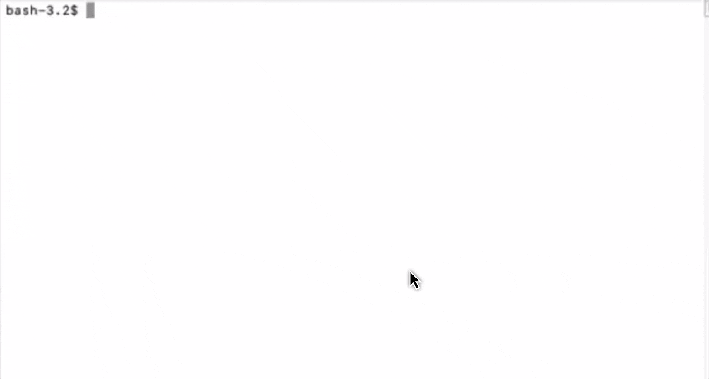

# og-local

> A local privacy proxy for coding agents.

[](https://github.com/outgate-ai/og-local/actions/workflows/ci.yml)
[](https://codecov.io/gh/outgate-ai/og-local)
[](https://goreportcard.com/report/github.com/outgate-ai/og-local)
[](LICENSE)

<p align="center">
  
</p>

When your coding agent reads a file, the file gets shipped to a third-party LLM. Often that's fine. The file is open-source, or your team has a vendor agreement that covers it. Sometimes it isn't: a `.env` slipped into a diff, a customer email in a test fixture, an API key in a comment, a stack trace from a private service.

**og-local** is a single binary that runs on your machine, intercepts the API calls your agent makes, detects PII and secrets in the prompt body before it leaves localhost, swaps them with opaque placeholders, forwards the redacted prompt upstream, and transparently restores the originals in the response. The agent never sees the difference. The upstream provider never sees the secrets.

Detection runs in-process via the [`openai/privacy-filter`](https://huggingface.co/openai/privacy-filter) ONNX model. There's no cloud round-trip and no network call to anywhere except the upstream provider you were already calling. The model is fetched once with `ogl model pull`; everything after that is local.

## Install

macOS / Linux:

```sh
curl -fsSL https://raw.githubusercontent.com/outgate-ai/og-local/main/scripts/install.sh | sh
```

Windows (PowerShell):

```powershell
irm https://raw.githubusercontent.com/outgate-ai/og-local/main/scripts/install.ps1 | iex
```

This installs the `ogl` binary and, on platforms that support redaction, places the bundled ONNX Runtime where `ogl` expects it. Then download the detection model once:

```sh
ogl model pull          # ~840MB into ~/.cache/og-local; also fetches the ONNX Runtime if missing
```

That's it — `ogl claude "..."` and `ogl codex "..."` now redact.

If anything is missing on first run, `ogl` offers to download it on the spot (showing the expected size) before launching the agent; in non-interactive sessions it keeps the explicit error instead.

**Manual download.** Grab a signed archive from [Releases](https://github.com/outgate-ai/og-local/releases/latest):
`ogl_<version>_<os>_<arch>.tar.gz` (or `.zip` on Windows). On a redaction-capable platform the archive contains the binary plus `lib/libonnxruntime.{so,dylib}` (`lib\onnxruntime.dll` on Windows); copy that lib to `~/.cache/og-local/runtime/<os>-<arch>/`, or point `OGL_ONNXRUNTIME_LIB` at it.

**`go install`.** `go install github.com/outgate-ai/og-local/cmd/ogl@latest` produces a **passthrough build only** — it cannot redact (no cgo, no bundled model runtime). Use the install script or a release archive for redaction.

## Platform support

| Platform | Redaction |
|---|---|
| linux / amd64 | ✅ full |
| linux / arm64 | ✅ full |
| macOS / arm64 (Apple Silicon) | ✅ full |
| Windows / amd64 | ✅ full |
| macOS / amd64 (Intel) | ⚠️ passthrough only |

Redaction needs two native libraries: [`daulet/tokenizers`](https://github.com/daulet/tokenizers) (the Windows staticlib is built from the pinned source during release, since upstream doesn't publish one) and [ONNX Runtime](https://github.com/microsoft/onnxruntime), which ships no Intel-macOS binary — hence the one passthrough target. On a passthrough platform `ogl claude`/`ogl codex` exit with a clear "this build cannot redact" message rather than forwarding your prompt unprotected.

> **macOS first run:** the binary and bundled library aren't notarized yet, so Gatekeeper may quarantine them. Clear it with `xattr -d com.apple.quarantine $(command -v ogl)` (and the lib under `~/.cache/og-local/runtime/`), or right-click → Open once.
>
> **Windows first run:** the `.exe` is unsigned, so SmartScreen may warn. Choose "More info" → "Run anyway", or unblock the file with `Unblock-File` in PowerShell.

## Verify the download

Releases ship `checksums.txt` and a keyless [cosign](https://github.com/sigstore/cosign) signature:

```sh
sha256sum -c checksums.txt          # or: shasum -a 256 -c checksums.txt

cosign verify-blob \
  --certificate-oidc-issuer https://token.actions.githubusercontent.com \
  --certificate-identity-regexp '^https://github.com/outgate-ai/og-local/.github/workflows/release.yml@refs/tags/v.*$' \
  --signature checksums.txt.sig \
  checksums.txt
```

## Quickstart

```sh
ogl model pull                      # one-time, ~800MB

# Anthropic-flavored agent
ogl claude "fix the failing test in cmd/server"

# OpenAI-flavored agent
ogl codex "review this PR"
```

`ogl` starts a local proxy on a random loopback port, points the child agent at it, and `exec`s the agent as a child process. Your full environment forwards to the child, and the agent keeps using whatever credentials it already has — `ogl` only redirects where the requests go. When the agent exits, `ogl` exits.

Most agents are redirected with their `*_BASE_URL` env var. Codex ignores that variable, so `ogl codex` instead writes a dedicated provider config under `~/.codex/ogl` (via `CODEX_HOME`) pointing Codex at the proxy; your own `~/.codex/config.toml` is left untouched.

`ogl codex` works with both Codex sign-in modes. With an API key (`OPENAI_API_KEY`, or `auth_mode = "apikey"` in `~/.codex/auth.json`) it forwards to `api.openai.com`. With a ChatGPT subscription login it forwards to `chatgpt.com/backend-api/codex`, the endpoint that login's token is scoped for — sending those requests to `api.openai.com` would fail. The mode is read from `~/.codex/auth.json`, with `OPENAI_API_KEY` taking precedence; either way the proxy forwards your existing Codex credentials and redacts the prompt body in between.

No daemon, no PID file, no global state.

## Use ogl in VS Code

The installer ships `ogl-claude` and `ogl-codex` alias binaries that behave exactly like `ogl claude` / `ogl codex`. Point the Claude Code extension at one and reload the window:

```jsonc
// settings.json
"claudeCode.claudeProcessWrapper": "/usr/local/bin/ogl-claude"
```

To watch redaction live, set `"OGL_DEBUG": "/tmp/ogl.log"` under `claudeCode.environmentVariables` and tail the file.

## How it works 

For each outbound request, `ogl` extracts the user-supplied content fields (`messages[].content`, `system`, tool-call inputs, and tool results), runs the ONNX-based PII detector locally over each field independently, replaces detected spans with opaque placeholders (`OG_PRIVATE_EMAIL_<hex>`, `OG_SECRET_<hex>`, and the like), forwards the rewritten body upstream, and inverts the substitution on the response, including streaming responses where placeholders may split across SSE events. Request frame fields (`model`, `temperature`, tool schemas, ids) are passed through unchanged. The placeholder↔value mapping lives only for the duration of a single request — there is no persistent vault. Placeholders themselves are deterministic for the lifetime of an `ogl` session: the same value redacts to the same placeholder on every request, so re-sent conversation history stays byte-identical and provider-side prompt caching keeps working.

## Supported providers

- OpenAI Chat Completions (`/v1/chat/completions`), streaming and non-streaming
- OpenAI Responses (`/v1/responses`) and ChatGPT-subscription Codex (`/backend-api/codex/responses`)
- Anthropic Messages (`/v1/messages`), streaming and non-streaming, including tool use
- Other paths pass through untouched

## Environment variables

| Variable | Purpose |
|---|---|
| `OGL_CLAUDE_BIN` / `OGL_CODEX_BIN` | Absolute path to the agent binary, for hosts that spawn `ogl` without your shell PATH. Normally unnecessary: on a PATH miss, `ogl` asks your login shell where the agent lives |
| `OGL_CACHE_DIR` | Override the model + runtime cache directory (default: `~/.cache/og-local`) |
| `OGL_DEBUG` | `1` logs proxy activity to a file (no PII values); a path chooses the file. The path is printed at startup |
| `OGL_ONNXRUNTIME_LIB` | Path to the ONNX Runtime shared library, overriding the default cache lookup |

## Contributing

See [CONTRIBUTING.md](CONTRIBUTING.md). The TL;DR:

```sh
git clone https://github.com/outgate-ai/og-local
cd og-local
make setup    # one-time: installs git hooks
make ci       # lint + tests + coverage + build
```

PRs against `main` require a passing CI run and one review. Conventional-commits subject lines are CI-enforced.

## License

Business Source License 1.1, converting automatically to Apache 2.0 on **2030-06-08**. See [LICENSE](LICENSE) for the precise terms.

In plain English: free to use, modify, and redistribute, including in commercial software. The one restriction until the change date is that you can't offer og-local (or a substantially-similar service) to third parties as a hosted multi-tenant service. After the change date, that restriction lifts and it's just Apache 2.0.

Licensor: Gatewise UG (haftungsbeschränkt). For commercial alternatives or questions: support@outgate.ai.
